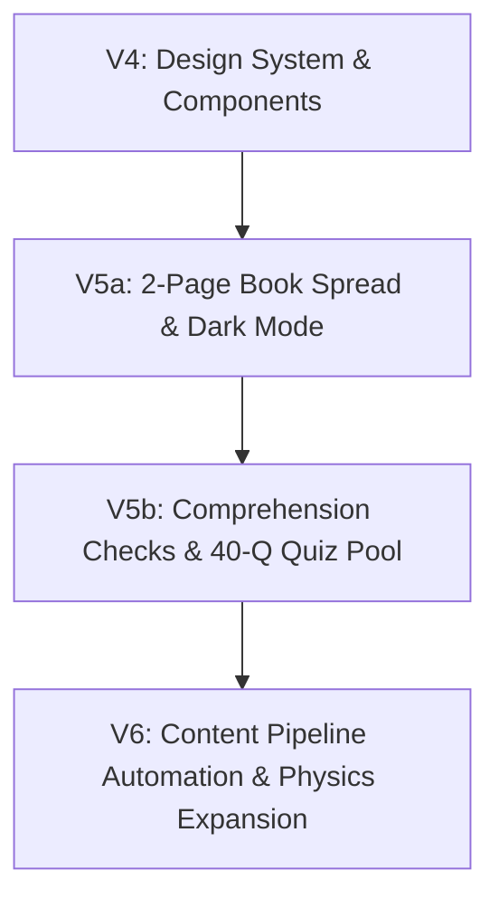

# Handoff Brief — Global Lab (STEM Learning Companion)

**Prepared by:** Antigravity (Manager / Senior Product & Architecture Analyst)  
**Date:** 2026-08-24  
**Target:** Pair Programming Team & Worker Models (Codex / Gemini / Claude)

---

## 1. Executive Summary & Project Context

### 1.1 What is Global Lab?
**Global Lab** is a high-performance, web-based STEM study companion designed to deliver a zero-friction, pre-built educational library with hyper-personalized learning rescue. 

Instead of forcing students to chat with an open-ended conversational bot or upload their own textbooks, Global Lab provides a pre-curated, curriculum-agnostic library of STEM knowledge (starting with Grade 10 Biology, expanding to Physics, Chemistry, and Mathematics) presented as a digital textbook spread (called **Kitabi** / Spread View).

### 1.2 The Core Pedagogical Innovation
- **Selective Analogy Substitution ("Learn It Your Way")**: Inspired by Google's LearnLM / Learn Your Way research (proven to yield ~11% retention gains in randomized trials).
- **Core Rule**: Scientific facts, mechanisms, and equations are **never altered or hallucinated**. When a student struggles with a section, clicking *"Learn it your way"* rewrites only the contextual framing and analogies mapped to the student's personal interest profile (e.g., Gaming, Sports, Music, or custom prompt), while leaving the canonical scientific text intact.
- **Contextual Rescue**: Personalization is an on-demand rescue tool for confusing sections, not a gimmick or permanent mode toggle.

---

## 2. Operating Model & Workflow Dynamics

### 2.1 Division of Responsibilities
```
┌──────────────────────────────────────────────────────────────────┐
│                      USER (Product Visionary)                    │
└─────────────────────────────────┬────────────────────────────────┘
                                  │ Directs, challenges, approves
                                  ▼
┌──────────────────────────────────────────────────────────────────┐
│          ANTIGRAVITY (Manager / Critical Analytical Partner)      │
│  - Never blindly agrees; challenges assumptions & spots flaws    │
│  - Researches licenses, pedagogy, source text, and image assets  │
│  - Authors rock-solid, unambiguous Codex Briefs (CODEX_BRIEF_*.md)│
│  - Does NOT directly modify production source code               │
└─────────────────────────────────┬────────────────────────────────┘
                                  │ Hands off self-contained brief
                                  ▼
┌──────────────────────────────────────────────────────────────────┐
│                     CODEX / WORKER (Execution Engine)            │
│  - Reads CODEX_BRIEF_Vx.md cold                                  │
│  - Implements TypeScript, React components, Tailwind & CSS       │
│  - Runs verification (tsc, oxlint, vite build)                   │
└──────────────────────────────────────────────────────────────────┘
```

### 2.2 Persona & Partnership Principles (Strict Rules)
1. **Critical Thinking Partner**: Antigravity never acts as a sycophantic yes-man. It actively questions assumptions, points out technical, licensing, or pedagogical risks, and proposes superior alternatives.
2. **Zero Direct Code Policy**: Antigravity formulates briefs, architectural plans, pipelines, and data extractions, leaving the frontend implementation to Codex/Worker models.
3. **No Placeholders / Full Fidelity**: When specs and briefs are authored, they must contain complete code blocks, exact types, and concrete values—no lazy `// todo` comments.

---

## 3. Repository & Tech Stack

- **Workspace Path:** `C:\Users\mhamm\Downloads\globallab`
- **Framework:** React 19 + Vite 8
- **Language & Types:** TypeScript ~6.0
- **Styling:** Tailwind CSS v4 + `@theme` CSS custom properties (Newsreader serif + Inter / Plus Jakarta Sans)
- **Mathematical Rendering:** KaTeX (LaTeX formatted equations)
- **Icons:** Lucide React (`^1.33.0`)
- **Linter & Verification:** `oxlint` + `tsc -b && vite build`
- **AI Integration:** Google Gemini 2.0 Flash (`@google/genai` or direct API calls with structured JSON responses via `VITE_GEMINI_API_KEY`)
- **Backend/Storage:** Zero backend architecture. All state, interest profiles, and cache reside in browser `localStorage`.

### Key Project Files & Directories
- `src/App.tsx`: Top-level router, state container (active topic, profile, dark mode, rewrite caching).
- `src/types/index.ts`: Canonical domain models (`KnowledgeTopic`, `KnowledgeSection`, `StudentProfile`, `KnowledgeDiagram`, `KnowledgeCallout`, `RewrittenSection`).
- `src/components/KitabiPage.tsx`: Book viewport container, subject color themes, layout coordinator.
- `src/components/KitabiSection.tsx`: 2-page spread rendering (Left: text + analogies; Right: diagrams, equations, callout boxes).
- `src/components/RunningHeader.tsx`: Textbook breadcrumbs, student interest badge, dark mode toggle.
- `src/components/TableOfContents.tsx`: Sticky sidebar TOC with active section observer.
- `src/components/DiagramBlock.tsx`: Clean image/caption/alt visual display with error boundary.
- `src/components/CalloutBox.tsx`: Real-world connection, exam alert, and historical note callout boxes.
- `src/components/AnalogyPanel.tsx`: Collapsible "Learn It Your Way" personalized analogy drawer.
- `src/knowledge/biology/*.ts`: Modular biology knowledge files (5 active topics).
- `public/diagrams/biology/`: Cleaned, high-resolution public domain SVG/PNG scientific diagrams.
- `siyavula_gr10_life_sciences_raw.txt`: Complete extracted text of Siyavula Grade 10 Life Sciences (evolution scrubbed).

---

## 4. Work Completed to Date

| Version | Status | Key Deliverables & Scope |
|---|---|---|
| **V1 & V2** | ✅ Complete | Initial prototype: Socratic progressive reveal, Cram/Explorer modes, PersonaBar, 5 basic biology topics. |
| **V3** | ✅ Complete | Complete transition to **Kitabi** textbook model. Introduction of `KnowledgeTopic` / `KnowledgeSection` architecture, Socratic analogies, KaTeX equations, SourcesFooter (CC BY attribution). |
| **V4** | ✅ Complete | Full Design System upgrade: Google Fonts (Newsreader + Plus Jakarta Sans), 3-column layout, `RunningHeader`, `TableOfContents` with IntersectionObserver, `CalloutBox`, `DiagramBlock`, `AnalogyPanel`. Brief: `CODEX_BRIEF_V4.md`. |
| **V5a** | ✅ Briefed / Deployed | 2-Page Book Spread layout (`book-scene` → `section-spread` with left/right page symmetry & spine), Dark Mode toggle + theme persistence. Brief: `CODEX_BRIEF_V5A.md`. |
| **Asset Curation** | ✅ Complete | Vetted 11 high-quality, public domain biology diagrams (1920px width) in `public/diagrams/biology/` (cell membrane, action potential, cellular respiration, enzyme kinetics, DNA transcription, translation ribosome, synapse transmission, osmosis, Na+/K+ pump, enzyme inhibition, Michaelis-Menten curve). |
| **Raw Content Dump** | ✅ Complete | Extracted 345 pages from Siyavula Grade 10 Life Sciences PDF (`siyavula_gr10_life_sciences_raw.txt`, 498KB), with evolution content completely removed per policy. |

---

## 5. Architectural Decisions & Non-Negotiable Constraints

1. **Strict Content Licensing**:
   - **Siyavula Life Sciences / Physical Sciences**: CC BY 3.0 (Commercial use allowed with clear attribution in `SourcesFooter`).
   - **NIH / NIAID / Wikimedia Public Domain & CC0**: Fully allowed for diagrams and assets.
   - **OpenStax**: **BLOCKED** (All books are CC BY-NC-SA, non-commercial clause prohibits commercial exploitation).
   - **CK-12**: **BLOCKED** (CC BY-NC).
2. **Content Policy (Evolution Exclusion)**:
   - All references to evolution and Chapter 11 (*History of Life on Earth*) have been completely purged from source text and knowledge files.
3. **No Hallucinated Facts**:
   - The AI only modifies the contextual metaphor/analogy around verified textbook facts. Canonical body text is immutable.
4. **Mock Fallback Resiliency**:
   - When no Gemini API key is provided, the app seamlessly falls back to pre-vetted preset analogies (Gaming, Sports, Music, Neutral) without throwing errors.
5. **No Backend / Authentication Requirements**:
   - Everything runs on the client. Zero login walls or cloud database latency through V5.

---

## 6. Forward Roadmap & Worker Action Plan



### 6.1 Next Immediate Phase: V5b (Comprehension Checks & Quiz Pipeline)
- **Trigger**: Skippable "Test Yourself" button at the end of each topic.
- **Question Pool Architecture**: Pre-generated pool of 40 questions per topic (8 questions per section across 5 sections).
- **Generation Script (`scripts/generate-questions.js`)**:
  - Automatically queries Gemini with strict prompt criteria.
  - Requires `sourceText` to appear verbatim in `section.body` for automatic validation.
  - Distractors must be plausible scientific misconceptions, not obvious nonsense.
- **Session UX**:
  - Picks 5 random questions per session (guaranteeing 8 unique test sessions before repeats).
  - All 5 questions presented together in a clean textbook examination layout.
  - Instant scoring with per-question green/red indicators + deep scientific explanations.
  - Progress tracked in `localStorage` (`globallab_quiz_history`).

### 6.2 Phase V6: Content Pipeline & Multi-Subject Scaling
- **Automated Ingestion Script (`scripts/process-siyavula-content.js`)**:
  - Reads `siyavula_gr10_life_sciences_raw.txt`.
  - Splits sections by regex (`/^\d+\.\d+\s+[A-Z]/m`).
  - Cleans production markers (`DUMMY`, `SHORTCODE`).
  - Calls Gemini 2.0 Flash to extract structured `{ heading, body, keyTerms[], equation?, diagram? }`.
  - Emits typed TypeScript files to `src/knowledge/biology/` and upcoming `src/knowledge/physics/`.
- **Siyavula Physics & Chemistry**: Ingest LaTeX source from `C:\Users\mhamm\Downloads\siyavula_source\CAPS\physical-science\grade-10\`.

---

## 7. External References & Reference Check

- **GitHub Repository Check (`officeofaitransformation / globalbio`)**:
  - User requested read-only check of `officeofaitransformation / globalbio`.
  - Status: Currently private or not publicly accessible on `github.com`. Logged as an external reference dependency to be provided by the user if access or code is needed.
- **Local Siyavula LaTeX Source**: `C:\Users\mhamm\Downloads\siyavula_source\CAPS\`
- **Public Domain Diagram Assets**: `C:\Users\mhamm\Downloads\globallab\public\diagrams\biology\`
